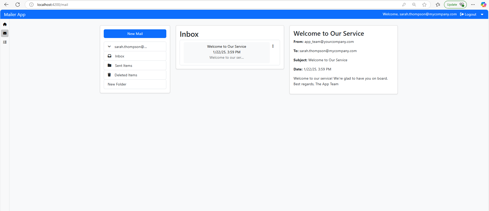

# WebMailClient
This project is a web-based mail client application built with Angular. It provides functionalities for managing emails, tasks, and user profiles.

## Features

- User authentication and authorization
- Email management (send, receive, delete), as well as creating folders to organize emails
- Task management (add, complete, delete)
- User profile management
- Admin functionalities for managing users
- Responsive design with Angular Material and Bootstrap

## Getting Started

### Prerequisites

Make sure you have the following installed on your machine:

- [Node.js](https://nodejs.org/) (version 14 or higher)
- [Angular CLI](https://angular.io/cli) (version 12 or higher)
- This project was generated using [Angular CLI](https://github.com/angular/angular-cli) version 19.0.6.

### Installation

1. Clone the repository:

    ```bash
    git clone https://github.com/papajohn-git/WebMail.client.git
    cd web-mail-client
    ```

2. Install the dependencies:

    ```bash
    npm install
    ```

### Running the Application

To start a local development server, run:

```bash
ng serve
 ```
### Screenshots

Screenshots provided for a visual representation of the application’s functionality and design.

   Description: WebMail - Preview

### Future Features
As we continue to enhance the functionality and user experience of our application, we have identified several key features that will be implemented in future updates:
- User Roles
- Cursor Pagination
- Searching Functionality

### Last but not least

To facilitate a smoother testing process for our application, we will temporarily relax the password complexity requirements while retaining the confirmation password field. The confirmation password will still be saved in the database during this testing phase.

## Contributing

Pull requests are welcome. Please open an issue first
to discuss what you would like to change.

## License

[MIT](https://choosealicense.com/licenses/mit/)


